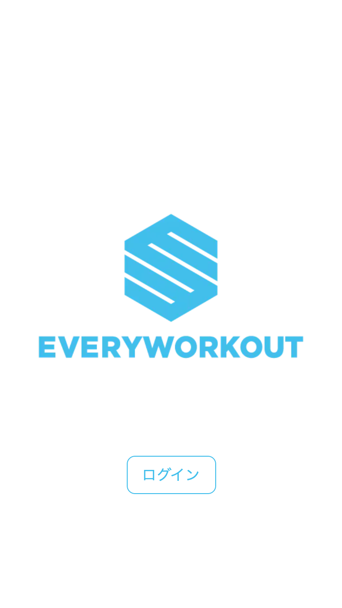
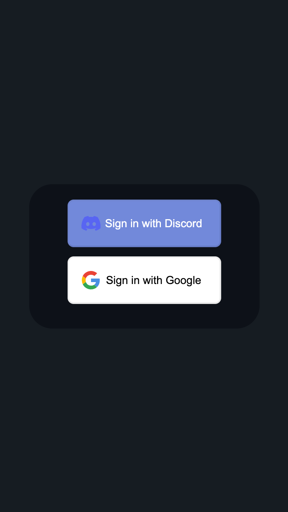
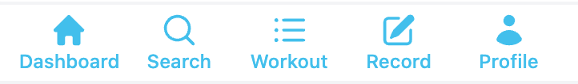
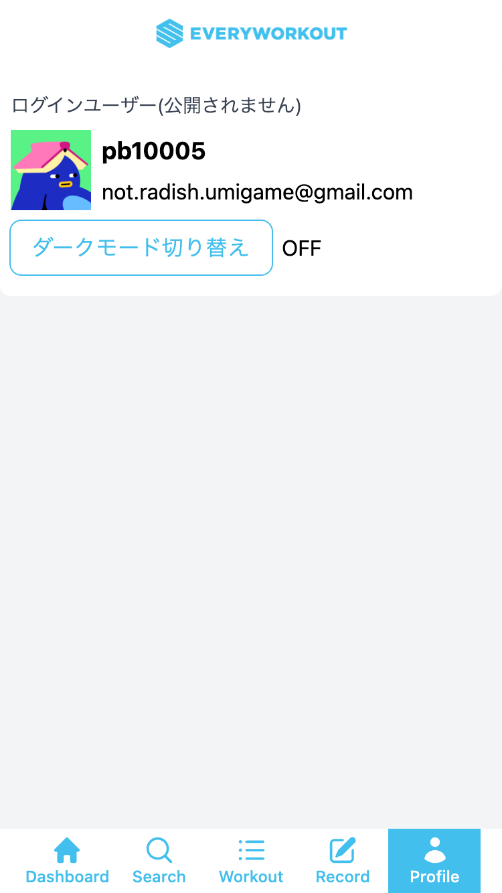

# 使い方

## 用意するもの
EVERYWORKOUTにはソーシャルアカウントを使ってログインします。以下のいずれかを用意してください。

- Googleアカウント
- Discordアカウント

## ログイン

[トップページ](https://everyworkout.vercel.app/)にアクセスしてログインボタンを押してください。

いずれかのサービスを選択すると、外部サイトに遷移してシングルサインオンを行います。

## ダッシュボード

- 今週のトレーニング履歴
- 目標
- 自己ベスト
- 週次レポート

## ボトムナビゲーション

- Dashboard: ダッシュボード
- Search: 検索機能
- Workout: トレーニングメニュー機能
- Record: 記録機能
- Profile: プロフィール

## ダークモード

プロフィール画面で「ダークモード切り替え」をタップすると、ライトモード/ダークモードを切り替えることができます。

