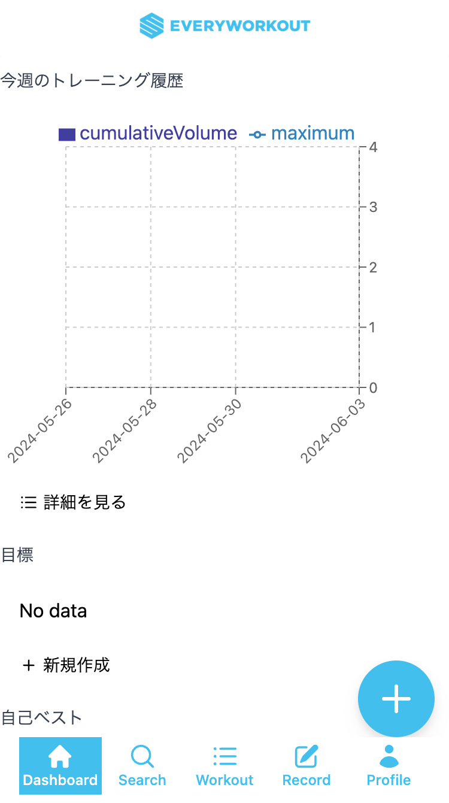
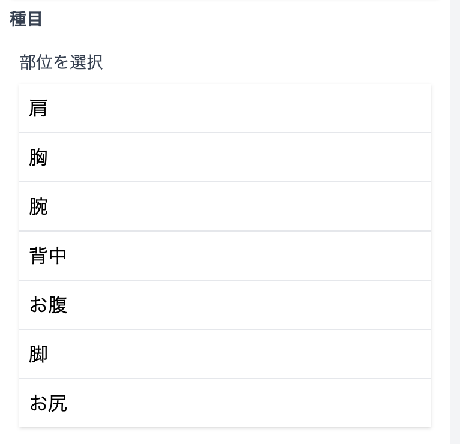
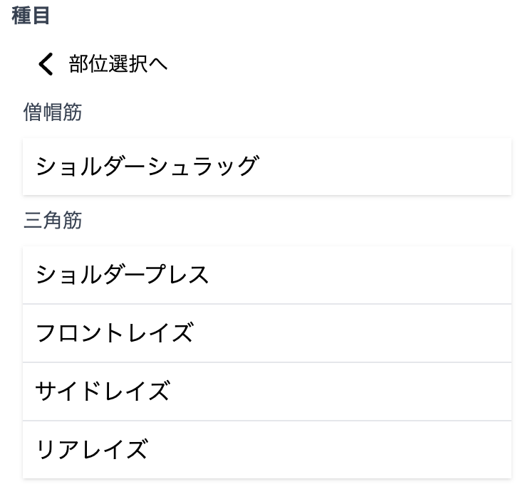
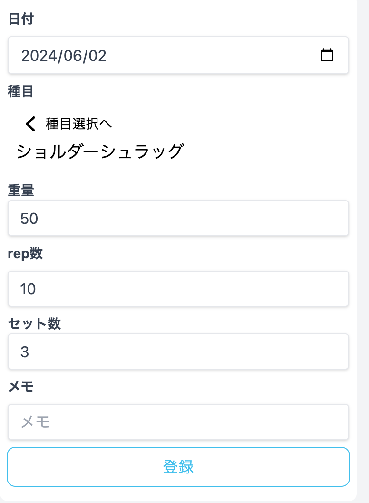

# 基本

日付、種目、重量、rep数、セット数を入力して記録します。

## 入力ページ

画面右下のフローティングボタンをタップすると、入力ページが表示されます。

## 種目選択機能の使い方
種目選択機能を使って２ステップで種目を選ぶことができます。

1. 部位を選ぶ  
  
1. 種目を選ぶ  
  
1. 種目選択済みの状態  
  

## 記録の登録
入力内容を確認したら、`登録`ボタンをタップして記録を登録します。

