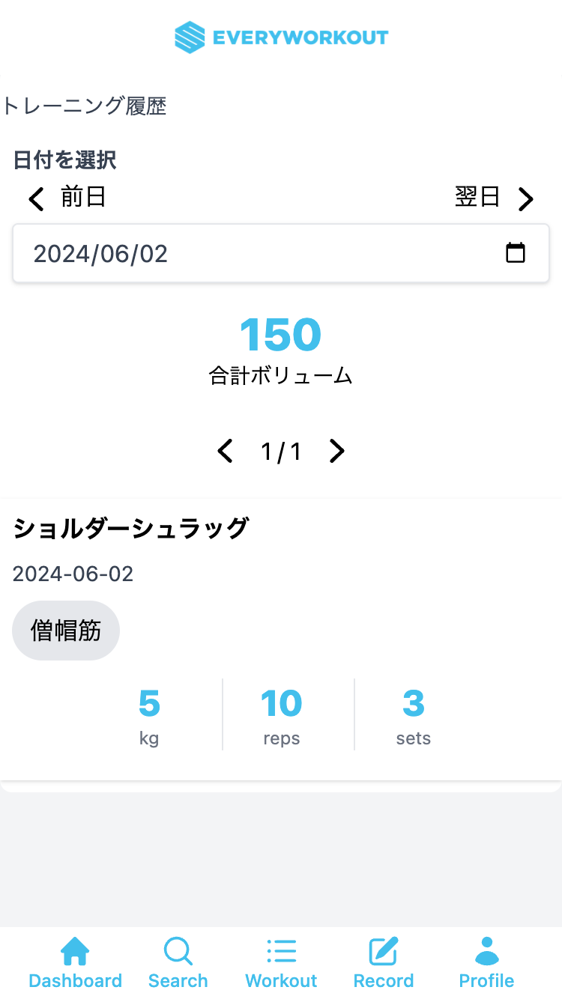

# 過去の記録を見る

日単位で過去のワークアウト記録を見ることができます。

## ワークアウト履歴の見方

ダッシュボードの`今週のトレーニング履歴`セクションにある`詳細を見る`ボタンをタップします。

- 前日/翌日ボタン: タップすると表示する日付を1日前/後に移動します。日付を直接入力して移動することも可能です。
- 合計ボリューム: 選択した日のトレーニングボリューム(重量×rep数×セット数の合計)を計算して表示します。
- ワークアウト詳細: タップするとワークアウト詳細のページに遷移します。
